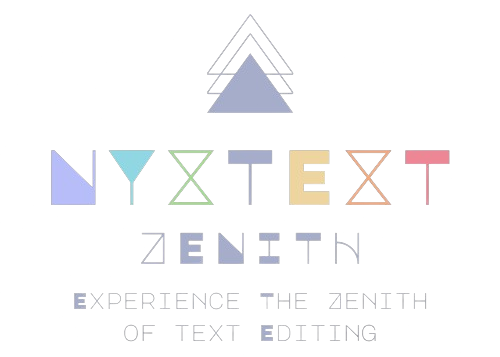

<h3 align="center">
	<br/>
    
    Nyxtext Zenith
	
</h3>

<h6 align="center">
  <a href="https://github.com/parazeeknova/nyxtext-zenith#note-">Info</a>
  ·
  <a href="https://github.com//parazeeknova/nyxtext-zenith#-installing-nyxtext">Install</a>
  ·
  <a href="https://github.com//parazeeknova/nyxtext-zenith#-early-editor-screenshots">Showcase</a>
  ·
  <a href="https://github.com/parazeeknova/nyxtext-zenith#-contributing">Contribution</a>
  ·
  <a href="https://github.com/parazeeknova/nyxtext-zenith#-support">Support</a>

</h6>

<p align="center">
  
</p>

&nbsp;

<p align="center">
	<a href="https://github.com/parazeeknova/nyxtext-zenith/stargazers">
		</a>
	<a href="https://github.com/parazeeknova/nyxtext-zenith/issues">
		</a>
    <a href="https://github.com/parazeeknova/nyxtext-zenith/releases">
    </a>
		</a>
</p>

<div align="center">

 
 


</div>

&nbsp;

<p align="center">
<strong>Nyxtext-zenith</strong> represents the next leap forward in text editing, building upon the foundation laid by its predecessor, <strong>Nyxtext</strong>. Reborn with PySide6 and QScintilla. As the successor to <strong>Nyxtext</strong>, the core mission of providing a comprehensive text editor for developers, students, and creatives. Nyxtext-zenith aims to surpass its forerunner by offering an even more robust, intelligent, and versatile text editing experience. It continues the nyxtext legacy of eliminating the need for multiple text-related applications, now with greater efficiency and an expanded feature set.
</p>

<p align="center">
  <a href="https://github.com/parazeeknova/nyxtext">
    <picture>
      <source srcset="assets/social/macchiato_github.svg" width="64" height="64" alt="Github Logo" media="(prefers-color-scheme: dark)"/>
      <source srcset="assets/social/latte_github.svg" width="64" height="64" alt="Github Logo" media="(prefers-color-scheme: light), (prefers-color-scheme: no-preference)"/>
      
    </picture>
  </a>
  
  <a href="https://discord.gg/UwmqqXkV">
    <picture>
      <source srcset="assets/social/macchiato_discord.svg" width="64" height="64" alt="Discord Logo" media="(prefers-color-scheme: dark)"/>
      <source srcset="assets/social/latte_discord.svg" width="64" height="64" alt="Discord Logo" media="(prefers-color-scheme: light), (prefers-color-scheme: no-preference)"/>
      
    </picture>
  </a>
  
  <a href="https://twitter.com/hashcodes_">
    <picture>
      <source srcset="assets/social/macchiato_twitter.svg" width="64" height="64" alt="Twitter Logo" media="(prefers-color-scheme: dark)"/>
      <source srcset="assets/social/latte_twitter.svg" width="64" height="64" alt="Twitter Logo" media="(prefers-color-scheme: light), (prefers-color-scheme: no-preference)"/>
      
    </picture>
  </a>
  
  <a href="https://www.reddit.com/user/parazeeknova">
    <picture>
      <source srcset="assets/social/macchiato_reddit.svg" width="64" height="64" alt="Reddit Logo" media="(prefers-color-scheme: dark)"/>
      <source srcset="assets/social/latte_reddit.svg" width="64" height="64" alt="Reddit Logo" media="(prefers-color-scheme: light), (prefers-color-scheme: no-preference)"/>
      
    </picture>
  </a>
</p>

---

> [!IMPORTANT]
> Because the application is not signed by Microsoft, Windows Defender blocks it; add an exclusion in Defender to run the application. Its a false positive, the application is safe to use. or build it yourself from the source code.

> [!NOTE] 
> Nyxtext & Nyxtext zenith is a work in progress. We appreciate any contributions, understanding that the project may have bugs, instability, and limited features during the time of active development. Please check back or join our Discord server to see our progress! 

### ✨ Installing Nyxtext

> [!TIP]
> Use Nerd Font to avoid any broken symbols : [JetbrainsMono Nerd Font](https://www.nerdfonts.com/font-downloads) 

<details>
<summary>Windows</summary>

There are multiple ways to run NyxText on Windows. Here are some common methods:

**There are two versions (Standalone & OneFile) for steps 1 & 2**
1. Using the standalone executable (recommended for users):
    - Download the latest stable release from the [Releases](https://github.com/parazeeknova/nyxtext-zenith/releases)
    - Extract the downloaded ZIP file
    - Add an exclusion in Windows Defender to run the application
    - Run the `Nyxtext.exe` file

2. Using development release (recommended for testers):
    - Download the latest development release from the [Action Build](https://github.com/parazeeknova/nyxtext-zenith/actions)
    - Extract the downloaded ZIP file
    - Add an exclusion in Windows Defender to run the application
    - Run the `Nyxtext.exe` file
 
3. Using development environment (recommended for developers):
    - Open a terminal and run the following commands:
      ```bash
      git clone --depth 1 https://github.com/parazeeknova/nyxtext-zenith.git
      cd nyxtext-zenith
      python -m venv .venv
      .venv\Scripts\activate
      pip install -r requirements.txt
      python -m zenith 
      OR run Nyxtext.py in the root directory
      ```

</details>

<details>

<summary>Debian-based Linux distributions (e.g. Ubuntu, Mint)</summary>

Didn't test it on Linux yet, but it should work. Currently only running from source code is supported.
**Open a terminal and run these commands:**

```bash
sudo apt update
sudo apt install python3 python3-pip python3-venv
git clone --depth 1 https://github.com/parazeeknova/nyxtext-zenith.git
cd nyxtext-zenith
python3 -m venv nyxtext
source nyxtext/bin/activate
pip install -r requirements.txt
python -m zenith 
OR run Nyxtext.py in the root directory
```
Let me know if it works.

</details>

<details>
<summary>Arch Linux</summary>

Didn't test it on Arch Linux yet, but it should work. Currently only running from source code is supported.
**To install NyxText on Arch Linux, you can follow these steps:**

```bash
sudo pacman -Sy python
git clone --depth 1 https://github.com/parazeeknova/nyxtext-zenith.git
cd nyxtext-zenith
python -m venv nyxtext
source nyxtext/bin/activate
pip install -r requirements.txt
python -m zenith 
OR run Nyxtext.py in the root directory
```
Let me know if it works.

</details>

<details>
<summary>MacOS</summary>

I don't have a Mac. If you have a Mac, you can help me a lot by installing
Nyxtext and letting me know how well it works.

</details>

### 🧠 Design Philosophy

- **Simplicity**: Keep the user interface clean and intuitive. Avoid cluttering the interface with unnecessary features or options. Focus on providing essential functionality in an easy-to-use manner.
- **Customizability**: Provide users with options to customize the editor to suit their preferences.
- **Modularity**: Design the codebase to be modular and extensible.
- **Maintainability**: Keep the codebase maintainable and readable.
- **Community Engagement**: Foster a vibrant and inclusive community around the editor. Encourage users to provide feedback, report bugs, and contribute code.
- **Feature Rich**: Have all the basic features for a text editor
- **User-centric:** Prioritize the developer's experience.
- **Keyboard-driven:** Minimize reliance on the mouse for efficiency.
- **Simplicity over Complexity:** Strive for an intuitive interface despite advanced features.

&nbsp;

### 🛹 Development


## ❓ FAQs:

### What's new in the latest NyxText release?

See [Releases](https://github.com/parazeeknova/nyxtext-zenith/releases).

<!-- ### Does NyxText support programming language X?
You will likely get syntax highlighting without any configuring
and autocompletions with a few lines of configuration file editing. -->

### Help! NyxtText Zenith doesn't work.

Install all the python pip packages from requirements.txt.
If it still doesn't work, [let me know by creating an issue on
GitHub](http://github.com/parazeeknova/nyxtext-zenith/issues/new).

### Is NyxText Zenith written in NyxText?

Not at the moment. We are writing the very first version in `Neovim`, but will use it when we are done with basic features.

### Why is it named NyxText Zenith?

1. **Mythological Inspiration:** `NyxText` draws upon the Greek goddess `Nyx`, associated with night, creation, and beginnings. This resonates with writers and programmers who often find inspiration during the quiet hours. The name subtly reflects this theme through its potential use of darker design elements.

2. **Euphony and Distinction:** `NyxText` possesses a pleasant sound with `Nyx` adding a touch of mystique. This name stands out from common text editors, making it both memorable and unique.

3. **Symbolic Alignment:**  `Nyx` can also symbolize the blank canvas or the void before creation. This perfectly aligns with the core function of a text editor - providing a blank slate for writers and programmers to bring their ideas to life.

4. **Zenith:** The term `Zenith` signifies the highest point or peak of development. By appending `Zenith` to `NyxText`, we emphasize the editor's evolution and growth beyond its predecessor. This name conveys a sense of progress, improvement, and ambition.

5. **Aesthetic Appeal:** The combination of `Nyx` and `Zenith` creates a harmonious and visually appealing name. The juxtaposition of the ancient and the modern, the night and the peak, adds depth and intrigue to the editor's identity.

### What is the difference between NyxText and NyxText Zenith?
NyxtText Zenith is a complete rewrite of NyxText, using PySide6 and QScintilla. It aims to provide a more robust, intelligent, and versatile text editing experience. NyxText Zenith builds upon the foundation laid by its predecessor, NyxText, with an expanded feature set and improved performance.

### I want an editor that does X, but X is not in the feature list above. Does NyxText do X?
You can run NyxText and find out,
or [create an issue on GitHub](https://github.com/parazeeknova/nyxtext-zenith/issues/new) and ask.
If you manage to make us excited about X, We might implement it.

### Why did you create a new editor?
Because I can.

### Why not use editor X?
Because Nyxtext Zenith is better.

---

### 👐 Contributing

> [!NOTE]
> Thank you for considering contributing to Nyxtext Zenith! We welcome contributions from everyone, whether you're fixing a bug, adding a feature, or improving documentation.

See [CONTRIBUTING.md](https://github.com/parazeeknova/nyxtext-zenith/blob/main/.github/CONTRIBUTING.md)

&nbsp;

### 📜 License

NyxText Zenith is released under the MIT license:
For more convoluted language, see the [LICENSE](https://github.com/parazeeknova/nyxtext-zenith/blob/main/LICENSE).

&nbsp;

<p align="center"></p>
<div align="center">


</div>
<p align="center">Copyright &copy; 2024-present <a href="https://github.com/parazeeknova/nyxtext-zenith" target="_blank">NyxText Zenith</a>
<p align="center"><a href="https://github.com/parazeeknova/nyxtext-zenith/blob/main/LICENSE"></a></p>

