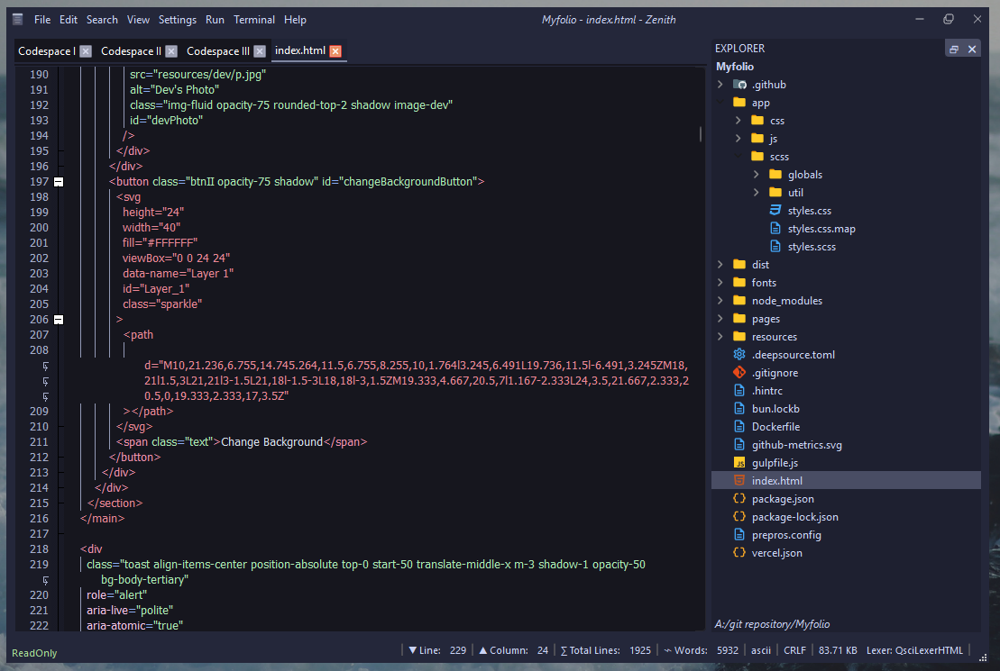

<h3 align="center">
	<br/>
</h3>

<h6 align="center">
  <a href="https://github.com//parazeeknova/nyxtext-zenith#-installing-nyxtext">Install</a>
  ·
  <a href="https://github.com//parazeeknova/nyxtext-zenith#-screenshots">Showcase</a>
  ·
  <a href="https://github.com/parazeeknova/nyxtext-zenith/blob/main/.github/CONTRIBUTING.md">Contribution</a>
  ·
  <a href="https://github.com/parazeeknova/nyxtext-zenith/blob/main/.github/ABOUT.md">About</a>

</h6>

<p align="center">
  
</p>

<p align="center">
	<a href="https://github.com/parazeeknova/nyxtext-zenith/stargazers">
		</a>
	<a href="https://github.com/parazeeknova/nyxtext-zenith/issues">
		</a>
    <a href="https://github.com/parazeeknova/nyxtext-zenith/releases">
    </a>
		</a>
</p>

<div align="center">

 
 


</div>

<details>
<summary>Project Structure</summary>

- [zenith](zenith/) - Main application directory
  - [Components](zenith/components/) - Components for the application
  - [Framework](zenith/framework/) - Framework for the application
  - [Lexers](zenith/lexers/) - Lexers for syntax highlighting
  - [Media](zenith/media/) - Media files
  - [Scripts](zenith/scripts/) - Scripts
  - [`__init__.py`](zenith/__init__.py) - Initialization
  - [`__main__.py`](zenith/__main__.py) - Entry point
  - [`color_schemes.lua`](zenith/color_schemes.lua) - Customizable color schemes
  - [`shortcuts.lua`](zenith/shortcuts.lua) - Customizable shortcuts
  - [`zenith_core.py`](zenith/zenith_core.py) - Core functionality
</details>

&nbsp;

<p align="center">
<strong>Nyxtext-zenith</strong> represents the next leap forward in text editing, building upon the foundation laid by its predecessor, <strong>Nyxtext</strong>. Reborn with PyQt6 and QScintilla. As the successor to <strong>Nyxtext</strong>, the core mission of providing a comprehensive text editor for developers, students, and creatives. Nyxtext-zenith aims to surpass its forerunner by offering an even more robust, intelligent, and versatile text editing experience. It continues the nyxtext legacy of eliminating the need for multiple text-related applications, now with greater efficiency and an expanded feature set.
</p>

<p align="center">
  <a href="https://github.com/parazeeknova/nyxtext">
    <picture>
      <source srcset="assets/social/macchiato_github.svg" width="64" height="64" alt="Github Logo" media="(prefers-color-scheme: dark)"/>
      <source srcset="assets/social/latte_github.svg" width="64" height="64" alt="Github Logo" media="(prefers-color-scheme: light), (prefers-color-scheme: no-preference)"/>
      
    </picture>
  </a>
  
  <a href="https://discord.gg/UwmqqXkV">
    <picture>
      <source srcset="assets/social/macchiato_discord.svg" width="64" height="64" alt="Discord Logo" media="(prefers-color-scheme: dark)"/>
      <source srcset="assets/social/latte_discord.svg" width="64" height="64" alt="Discord Logo" media="(prefers-color-scheme: light), (prefers-color-scheme: no-preference)"/>
      
    </picture>
  </a>
  
  <a href="https://twitter.com/hashcodes_">
    <picture>
      <source srcset="assets/social/macchiato_twitter.svg" width="64" height="64" alt="Twitter Logo" media="(prefers-color-scheme: dark)"/>
      <source srcset="assets/social/latte_twitter.svg" width="64" height="64" alt="Twitter Logo" media="(prefers-color-scheme: light), (prefers-color-scheme: no-preference)"/>
      
    </picture>
  </a>
  
  <a href="https://www.reddit.com/user/parazeeknova">
    <picture>
      <source srcset="assets/social/macchiato_reddit.svg" width="64" height="64" alt="Reddit Logo" media="(prefers-color-scheme: dark)"/>
      <source srcset="assets/social/latte_reddit.svg" width="64" height="64" alt="Reddit Logo" media="(prefers-color-scheme: light), (prefers-color-scheme: no-preference)"/>
      
    </picture>
  </a>
</p>

---

> [!IMPORTANT]
> Because the application is not signed by Microsoft, Windows Defender blocks it; add an exclusion in Defender to run the application. Its a false positive, the application is safe to use. or build it yourself from the source code.


### 🖼️ Screenshots

| Default Look | Python Lexer | Docked FileTree | Menu Bar (File) |
|--------------|--------------|--------------|--------------|
|  |  |  |  |


### ✨ Installing Nyxtext

<details>
<summary>Windows</summary>

There are multiple ways to run NyxText on Windows. Here are some common methods:

1. Using the standalone executable (recommended for users):
    - Download the latest stable release from the [Releases](https://github.com/parazeeknova/nyxtext-zenith/releases)
    - Extract the downloaded ZIP file
    - Add an exclusion in Windows Defender to run the application
    - Run the `Nyxtext.exe` file

2. Using development release (recommended for testers):
  
    > [!CAUTION]
    > Currently action builds are not working due to some issues, please use the standalone executable from releases .

    - Download the latest development release from the [Action Build](https://github.com/parazeeknova/nyxtext-zenith/actions)
    - Extract the downloaded ZIP file
    - Add an exclusion in Windows Defender to run the application
    - Run the `Nyxtext.exe` file
 
1. Using development environment (recommended for developers):
    - Open a terminal and run the following commands:
      ```bash
      git clone --depth 1 https://github.com/parazeeknova/nyxtext-zenith.git
      cd nyxtext-zenith
      python -m venv .venv
      .venv\Scripts\activate
      pip install -r requirements.txt
      python -m zenith 
      OR run Nyxtext.py in the root directory
      ```
2. Using Build script (recommended for developers):
    - Open a terminal and run the following commands:
      ```bash
      git clone --depth 1 https://github.com/parazeeknova/nyxtext-zenith.git
      cd nyxtext-zenith
      run windows-build.bat
      ```

</details>

<details>

<summary>Debian-based Linux distributions (e.g. Ubuntu, Mint)</summary>

Didn't test it on Linux yet, but it should work. Currently only running from source code is supported.
**Open a terminal and run these commands:**

```bash
sudo apt update
sudo apt install python3 python3-pip python3-venv
git clone --depth 1 https://github.com/parazeeknova/nyxtext-zenith.git
cd nyxtext-zenith
python3 -m venv nyxtext
source nyxtext/bin/activate
pip install -r requirements.txt
python -m zenith 
OR run Nyxtext.py in the root directory
```
Let me know if it works.

</details>

<details>
<summary>Arch Linux</summary>

Didn't test it on Arch Linux yet, but it should work. Currently only running from source code is supported.
**To install NyxText on Arch Linux, you can follow these steps:**

```bash
sudo pacman -Sy python
git clone --depth 1 https://github.com/parazeeknova/nyxtext-zenith.git
cd nyxtext-zenith
python -m venv nyxtext
source nyxtext/bin/activate
pip install -r requirements.txt
python -m zenith 
OR run Nyxtext.py in the root directory
```
Let me know if it works.

</details>

<details>
<summary>MacOS</summary>

I don't have a Mac. If you have a Mac, you can help me a lot by installing
Nyxtext and letting me know how well it works.

</details>

### 🎨 Features :
- Edit Text files ~ duh.
- Basic funcaionality of a text editor like save, open, close, etc.
- **Syntax Highlighting** for _**35+**_ languages.
- Catppuccin Macciatto theme by default for Python, C++, Javascript, HTML, CSS, JSON, Markdown, and more.
- **Code Folding** for better code readability.
- **Filetree** for easy navigation. (Toggle with `Ctrl + F`)
- **Dockable Filetree** panes.
- Adjustable panes for Filetree, Workspace, and Codespace.
- **Customizable** shortcuts using Lua, edit `zenith/shortcuts.lua`.
- **Highly Customizable** themes using Lua, edit `zenith/color_themes.lua`.
- Workspace and Codespace tabs for better organization.
- **Tab** switching using `Ctrl + Tab` and `Ctrl + Shift + Tab`.
- Unsaved changes indicator.
- **Auto-indentation** for Python, C++, Java, and more.
- Files can be opened from CLI using `Nyxtext.exe -o <filename>` or `Nyxtext.exe --open <filename>`.
- Custom titlebar with inbuild menubar.
- Statusbar with line and column number.
- Dynamic **statusbar** that displays operations performed.

_More features coming soon._

### ⌨️ Shortcut Keys

> [!TIP]
> These are the default shortcut keys, you can change them from `shortcuts.lua` in `zenith` folder.

| Shortcut Key | Description |
| ------------ | ----------- |
| `Ctrl + N` | Create a new Workspace Tab (for txt editing) |
| `Ctrl + Shift + N` | Create a new Codespace Tab (for code editing) |
| `Ctrl + O` | Open File (automatically detects filetype and opens in Workspace os Codespace) | 
| `Ctrl + Shift + O` | Open Folder in Filetree|
| `Ctrl + S` | Save File |
| `Ctrl + Shift + S` | Save File As |
| `Ctrl + Tab` | Switch Tab next |
| `Ctrl + Shift + Tab` | Switch Tab previous |
| `Ctrl + F` | Show/hide FileTree |
| `Ctrl + W` | Close Tab |
| `Ctrl + Shift + W` | Close All Tabs |
| `Ctrl + Shift + Q` | Exit |
| `...` | More soon |

> [!TIP]
> Files can be opened by CLI using `Nyxtext.exe -o <filename>` or `Nyxtext.exe --open <filename>`.

### 💡Future Plans : 
- [x] ~~Build `exe` for windows~~ - ✅ Done in alphav0.0.1
- [ ] Complete Menu bar options.
- [ ] Add more themes.
- [ ] Add more languages for syntax highlighting.
- [ ] Terminal integration.
- [ ] Add more shortcuts. (VIM MOTIONS)
- [ ] Autocompletions for Python, C++, Javascript, and more.
- [ ] Linux and MacOS support.
- [ ] Grammer check for Workspace.
- [x] ~~Code folding for Codespace.~~ - ✅ Done in alphav0.0.2
- [ ] Git support
- [ ] Hyperlinks, Markdown support
- [ ] Split view for Codespace
- [ ] AI Integration for code suggestions
- [ ] More to come...
&nbsp;

### 🛹 Development


---

### 👐 Contributing

> [!NOTE]
> Thank you for considering contributing to Nyxtext Zenith! We welcome contributions from everyone, whether you're fixing a bug, adding a feature, or improving documentation.

See [CONTRIBUTING.md](https://github.com/parazeeknova/nyxtext-zenith/blob/main/.github/CONTRIBUTING.md)

### 📜 License

NyxText Zenith is released under the MIT license:
For more convoluted language, see the [LICENSE](https://github.com/parazeeknova/nyxtext-zenith/blob/main/LICENSE).

<p align="center"></p>

<p align="center">Copyright &copy; 2024-present <a href="https://github.com/parazeeknova/nyxtext-zenith" target="_blank">NyxText Zenith</a>
<p align="center"><a href="https://github.com/parazeeknova/nyxtext-zenith/blob/main/LICENSE"></a></p>

